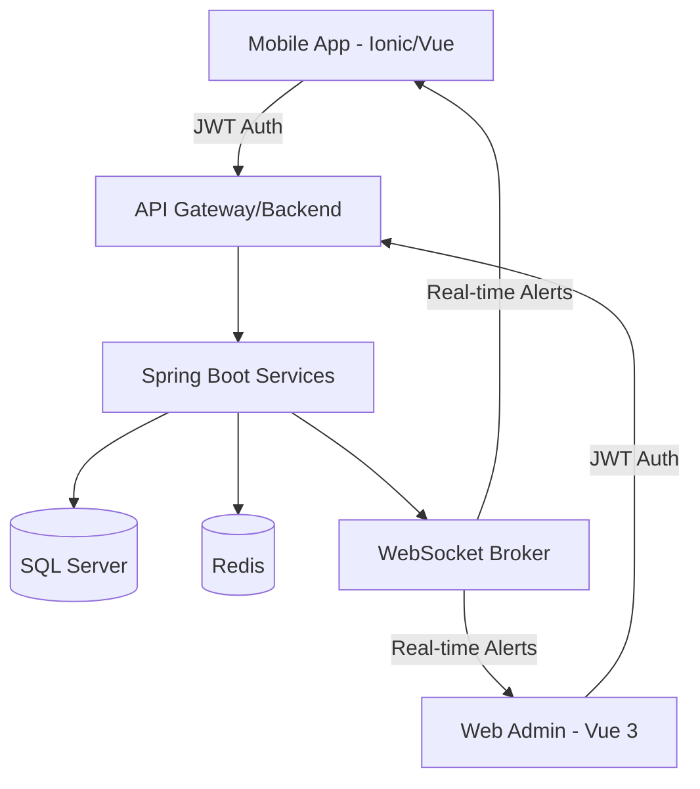

# 🚀 BranchCore - Integrated Management System (IMS)

[](https://www.oracle.com/java/)
[](https://spring.io/projects/spring-boot)
[](https://vuejs.org/)
[](https://ionicframework.com/)
[](https://www.microsoft.com/sql-server)

**BranchCore** is a comprehensive enterprise solution designed to streamline operations across multiple retail branches. It integrates multi-channel management (Web Admin & Mobile App) to handle inventory, human resources, attendance tracking, and internal communications in real-time.

---

## 🌟 Key Features

### 1. Multi-Branch Inventory Ecosystem
- **Real-time Tracking:** Monitor stock levels across all branches with instant updates.
- **Approval Workflow:** Sophisticated multi-step approval process for stock transfers and requests.
- **Financial Integration:** Automated inventory valuation and financial reporting using Apache POI for Excel exports.

### 2. Smart Attendance & HR Management
- **GPS-Fence Verification:** Enforces attendance only within a specific radius of the store using high-accuracy geolocation.
- **Photo Identity Confirmation:** Captures employee photos during check-in/out to prevent "buddy punching".
- **Estimated Payroll:** Real-time salary estimation based on actual working hours and hourly rates.

### 3. Internal Communications (Internal News)
- **Centralized Broadcast:** Admin can publish internal announcements directly to the mobile app.
- **Auto-Expiry System:** Announcements are automatically cleaned up based on a set duration (1, 3, 7 days) using Spring Scheduling.

### 4. Real-time Infrastructure
- **WebSocket Notifications:** Instant alerts for stock requests, approval results, and system updates.
- **Security:** Robust authentication layer using Spring Security and JWT.

---

## 🛠 Tech Stack

### Backend
- **Core Framework:** Spring Boot 3.2.4 (Java 17)
- **Security:** Spring Security, JWT (Stateless authentication)
- **Persistence:** Spring Data JPA, Hibernate 6
- **Database:** Microsoft SQL Server
- **Caching:** Redis (Session & Data caching)
- **Communication:** WebSocket (STOMP/SockJS)
- **Tools:** Maven, Lombok, Apache POI

### Frontend (Web Admin)
- **Framework:** Vue.js 3 (Composition API)
- **UI Library:** Element Plus (Premium Meta-design system)
- **State Management:** Pinia
- **Build Tool:** Vite

### Mobile App (Hybrid)
- **Framework:** Ionic 7 + Vue 3
- **Native Bridge:** Capacitor (Camera, Geolocation)
- **Styling:** Custom Vanilla CSS for premium aesthetics

---

## 🏗 System Architecture



---

## 🚀 Installation & Setup

### Prerequisites
- JDK 17+
- Node.js 18+
- SQL Server 2019+

### Backend Setup
1. Clone the repository
2. Update `application.properties` with your SQL Server credentials.
3. Run the application:
   ```bash
   mvn spring-boot:run
   ```

### Web Admin Setup
1. Navigate to `/branch-management-fe`
2. Install dependencies: `npm install`
3. Start dev server: `npm run dev`

### Mobile App Setup
1. Navigate to `/chamcong_mobile`
2. Install dependencies: `npm install`
3. Run on Android/iOS: `npx cap open android`

---

## 📸 Demo Screenshots

| Dashboard (Web) | Attendance (Mobile) | Payroll (Mobile) |
| :---: | :---: | :---: |
|  |  |  |

---

## 👨‍💻 Developer
**[Your Name]**
- Role: Fullstack Developer
- Project Scope: Graduation Project (DoAnTotNghiep)

---
*Developed with ❤️ by the Branch Management Team.*
