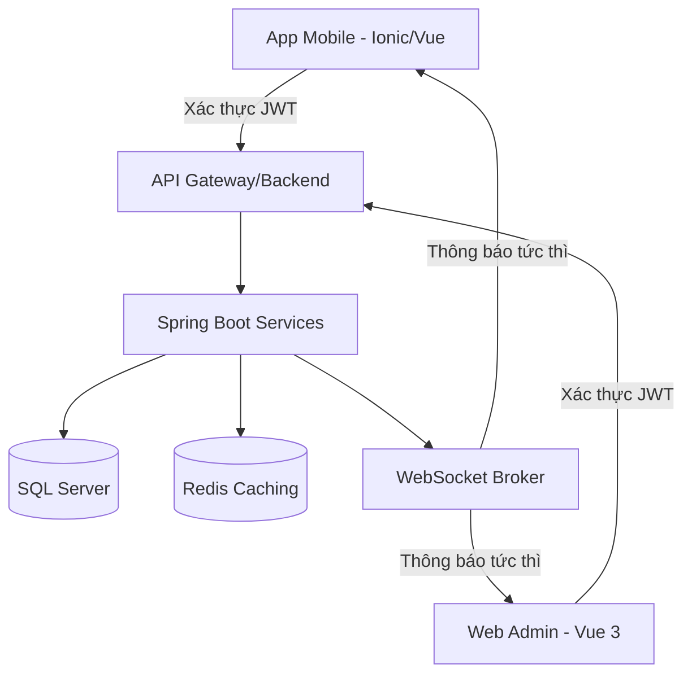

# 🚀 BranchCore - Hệ Thống Quản Lý Chuỗi Chi Nhánh Hợp Nhất (IMS)

[](https://www.oracle.com/java/)
[](https://spring.io/projects/spring-boot)
[](https://vuejs.org/)
[](https://ionicframework.com/)
[](https://www.microsoft.com/sql-server)

**BranchCore** là một giải pháp quản trị doanh nghiệp toàn diện, được thiết kế để tối ưu hóa quy trình vận hành cho các chuỗi cửa hàng/chi nhánh bán lẻ. Hệ thống kết hợp đa nền tảng (Web Admin & App Mobile) để quản lý kho hàng, nhân sự, chấm công và truyền thông nội bộ theo thời gian thực.

---

## 🌟 Các Tính Năng Trọng Tâm

### 1. Hệ Sinh Thái Quản Lý Kho Đa Chi Nhánh
- **Theo dõi thời gian thực:** Giám sát mức tồn kho trên toàn hệ thống với cập nhật tức thì.
- **Quy trình Phê duyệt:** Luồng nghiệp vụ phức tạp cho việc điều chuyển hàng hóa và yêu cầu nhập kho giữa các chi nhánh.
- **Báo cáo Tài chính:** Tự động tính toán giá trị kho và xuất báo cáo Excel chuyên nghiệp (sử dụng Apache POI).

### 2. Quản Lý Nhân Sự & Chấm Công Thông Minh
- **Xác thực GPS-Fence:** Chỉ cho phép chấm công trong bán kính cho phép tại cửa hàng bằng thuật toán định vị độ chính xác cao.
- **Xác thực Khuôn mặt/Ảnh chụp:** Chụp ảnh nhân viên lúc check-in/out để ngăn chặn tình trạng chấm công hộ.
- **Ví Lương Dự Tính:** Tính toán lương thực tế dựa trên tổng giờ công và hệ số lương ngay trên App Mobile.

### 3. Truyền Thông Nội Bộ (Tin Tức)
- **Bảng tin tập trung:** Admin đăng thông báo, lịch nghỉ lễ trực tiếp xuống App của toàn bộ nhân viên.
- **Hệ thống Tự động xóa:** Thông báo tự động hết hạn và xóa khỏi hệ thống sau 1, 3 hoặc 7 ngày (sử dụng Spring Scheduling).

### 4. Hạ Tầng Real-time & Bảo Mật
- **Thông báo WebSocket:** Nhận cảnh báo tức thì về yêu cầu kho, kết quả phê duyệt và tin nhắn hệ thống.
- **Bảo mật đa lớp:** Hệ thống xác thực dựa trên Spring Security và JWT (JSON Web Token).

---

## 🛠 Công Nghệ Sử Dụng

### Backend (Máy chủ)
- **Ngôn ngữ:** Java 17
- **Framework:** Spring Boot 3.2.4
- **Bảo mật:** Spring Security, JWT (Stateless)
- **Lưu trữ:** Spring Data JPA, Hibernate 6
- **Cơ sở dữ liệu:** Microsoft SQL Server
- **Bộ nhớ đệm:** Redis (Caching dữ liệu & Session)
- **Giao tiếp:** WebSocket (STOMP/SockJS)
- **Thư viện bổ trợ:** Maven, Lombok, Apache POI (Excel)

### Frontend (Quản trị Web)
- **Framework:** Vue.js 3 (Composition API)
- **Thư viện UI:** Element Plus (Thiết kế theo phong cách Meta hiện đại)
- **Quản lý trạng thái:** Pinia
- **Công cụ build:** Vite

### Mobile App (Ứng dụng di động)
- **Framework:** Ionic 7 + Vue 3
- **Native Bridge:** Capacitor (Sử dụng Camera, Geolocation native)
- **Styling:** Custom CSS (Giao diện Premium, mượt mà)

---

## 🏗 Kiến Trúc Hệ Thống



---

## 🚀 Hướng Dẫn Cài Đặt

### Yêu cầu hệ thống
- JDK 17 trở lên
- Node.js 18 trở lên
- SQL Server 2019 trở lên

### Cài đặt Backend
1. Clone dự án về máy.
2. Cập nhật thông tin kết nối SQL Server trong `application.properties`.
3. Chạy lệnh:
   ```bash
   mvn spring-boot:run
   ```

### Cài đặt Web Admin
1. Truy cập thư mục `/branch-management-fe`
2. Cài đặt thư viện: `npm install`
3. Chạy dự án: `npm run dev`

### Cài đặt App Mobile
1. Truy cập thư mục `/chamcong_mobile`
2. Cài đặt thư viện: `npm install`
3. Chạy trên thiết bị: `npx cap open android`

---

## 📸 Hình Ảnh Minh Họa

| Dashboard (Web) | Chấm công (Mobile) | Ví lương (Mobile) |
| :---: | :---: | :---: |
|  |  |  |

---

## 👨‍💻 Thông tin Tác giả

* **Tác giả:** Lê Tấn Lợi
* **Đơn vị:** Sinh viên FPT Polytechnic và Học viện Green Academy
* **Kỹ năng:** Unity Developer, Software Engineer (Spring Boot, Vue.js, C#).
* **Liên hệ:** loiletan04@gmail.com
